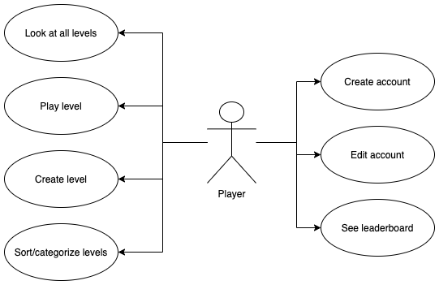

# Deliverable 2 - Requirements

*Group 5 - “CS Play”*   
*Date:* 26 September, 2021

*Group members: Aidan Sullivan, Emma Carlsson, Johnathan Ray, Vincent Machado, Jiasheng Yang, Pengfei Liu* 

## 1. Positioning

### 1.1 Problem statement
There is the common phenomenon that most of people think programming is hard and boring to learn. In addition, the lack of engagemment from learning programming affects beginner programmers and non-programmers. All of factors make people lose interest or have no interest in programming.

### 1.2 Product Position Statement
For beginner programmers and non-programmers who are not interested in learning programming, CS-Play is an interactive learning platform that teaches programming with puzzles and games, unlike traditional teaching methods in the classroom or by the video guidance, which have little to no interactivity. Our product allows users to "write code" immediately by playing games that are more like adventures with guidance and direct results(grades and feedback). The users also can share their works in our community so that they could learn from each other, which everybody is taking part in wins.

### 1.3 Value proposition and customer segment
**Initial value proposition:**  
CS-Play makes learning programming for beginners easy and fun like never before.

**Initial value proposition:**  
Easier and happier for programming.

**Consumer segments:**
* Younger people are 16-25 years old
* Beginner programmers
* People who want to learn something about programming

## 2. Stakeholders
* Developers (We)
* Beginner programmers
* Non-programmers that want to learn programming
* Educators/teachers/expert programmers (May recommand our product to their students or newcomers)

## 3. Functional requirements (features)
* Create your own account
* Allow user to play levels created by others
* Provide some measure of user’s success
* Show and tell a user about the varying topics
* Provide assistance for struggling users
* Provide visual feedback for how well someone is doing
* Allow users to create their own levels
* Show a “leaderboard” that indicates a user’s degree of success compared to others

## 4. Non-functional requirements

## 5. MVP

## 6. Use cases

### 6.1 Use case diagram

### 6.2 Use case descriptions and interface sketch
**Use case:** Play level  
**Actor:** User   
**Description:** The user can play the level they select    
**Preconditions:** The user has an account and looks at the available levels   
**Postconditions:** The user has played a level   
**Main flow:**
1. The user selects a level
2. The user plays the selected level

## 7. User stories
**User story 1:** "As a user, I want to play a level so I can learn programming"  
**Priority:** 1   
**Estimated hours:** 12 

**User story 2:** "As a user, I want to look at all the available levels so that I can select one and play"  
**Priority:** 4   
**Estimated hours:** 4

**User story 3:** "As a beginner programmer, I want to learn a programming language systematically so that I can apply it in diverse situations."  
**Priority:** 2   
**Estimated hours:** 5

**User story 4:** "As a beginner programmer, I want to share my works in the community so that I can learn from each other."  
**Priority:** 4   
**Estimated hours** 4

## 8. Issue Tracker
