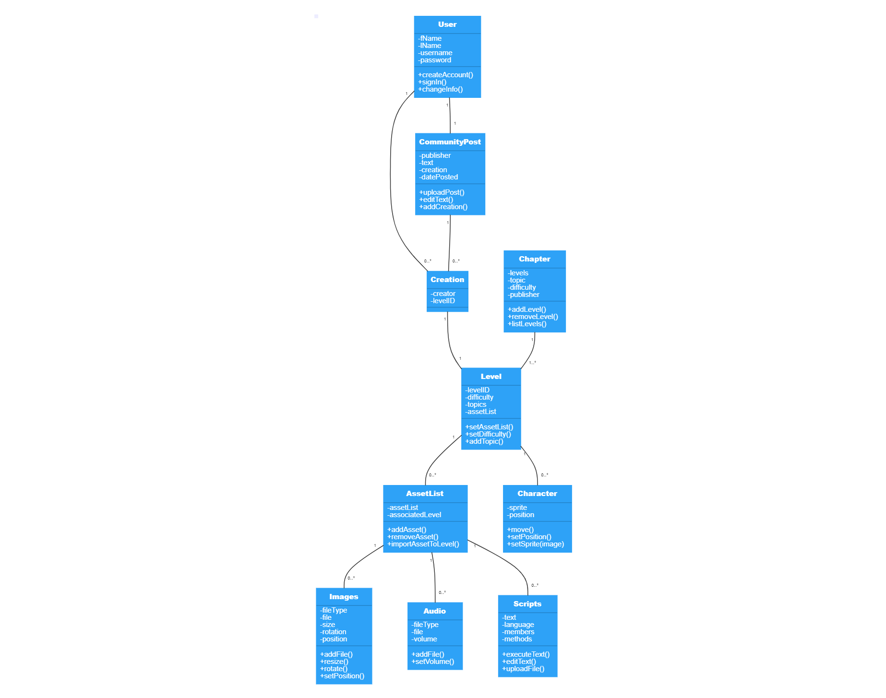

# Deliverable 3 - Analysis

*Group 5 - “CS Play”*   
*Date:* 10 October, 2021    
*Group members: Aidan Sullivan, Emma Carlsson, Johnathan Ray, Vincent Machado, Jiasheng Yang, Pengfei Liu*    

## 1. System Description

### provide a brief textual description of the system

**The problem statement:**
It is a common phenomenon that most people think programming is hard and boring to learn. In addition, the lack of engagement from learning programming affects beginner programmers and non-programmers. These factors make people lack interest in programming.

**the product position statement:**
For beginner and non-programmers who are interested in learning programming, CS-Play is an interactive platform that teaches programming with puzzles and games. Unlike traditional teaching methods in class and video tutorials, which have little to interactivity. Our product allows users to “write code” immediately by playing games that are more like adventures with guidance and direct results (grades and feedback). The user can share their work in our community so that they could learn from each other, which is a win for everyone.

**the value proposition of the system:**
CS-Play makes learning programming for beginners easy and fun like never before.

**Use UML, adequately**
* Register info: name, age, sex, address, email
* User: players, administrators, website maintainers
* Level: level1,2,3,4,5
* Action: move left, move right, move up and move down
* Display: display the playing result
* HelpBehavior: display the right action
* Map: width, hight; getKey, victoryGraph, remove
* EndGame: restart, thisEnd
* HistoryRecord: passlevel, unpasslevel
* Database: add info, delete info, revise info, search info 

**Relational database systems**
* MySQL for database
* Panda for data analyse

## 2. Model

